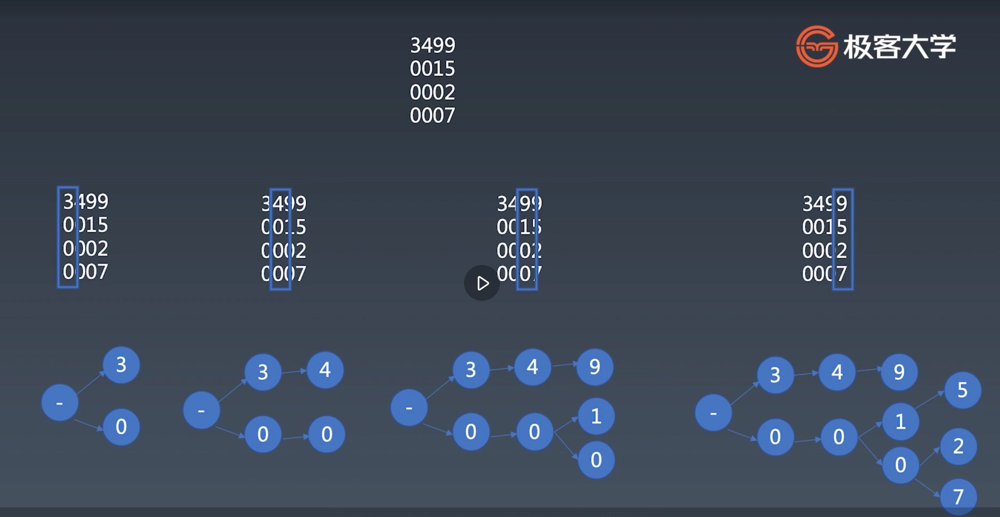

## 字符串分析算法
1. 字典树
    + 大量高重复字符串的存储与分析
    + 使用情况1亿字符集，找频度。
1. KMP（长字符串里找部分字符串，部分匹配）
    + 在长字符串里找模式
1. wildcard
    + 带通配符的字符串模式
1. 正则
    + 字符串通用模式匹配
1. 状态机
    + 通用的字符串分析
1. LL LR
    + 字符串多层级结构分析

## 字典树

    
