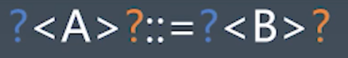

## 语言按语法分类
1. 非形式语言
    - 中文，英文
2. 形式语言（乔姆斯基谱系）
    - 0型 无限制方法
    - 1型 上下文相关方法
    - 2型 上下文无关文法
    - 3型 正则文法

    **0，1，2，3**是包含关系 2型包含1、0型。

## 产生式（BNF巴科斯-诺尔范式）
1. 用尖括号括起来的名称来表示语法结构名
1. 语法结构分成基础结构和需要用其他语法结构定义的复合结构
    - 基础结构称终结符(Terminal Symbol)--叶子结点的意思。
    - 复合结构称非终结符(Nonterminal Symbol)
1. 引号和中间的字符表示终结符
1. 可以有括号
1. `*`表示重复多次
1. `|`表示或
1. `+`表示至少一次

## 产生式--四则运算
### 四则运算
- `1+2*3`
### 终结符：
- `Number`
- `+ - * /`
### 非终结符
- MultiplicativeExpression(乘法结构)
- AddtiveExpression(加法结构)

```txt
<MultiplicativeExpression>::=<Number>|
    <MultiplicativeExpression>"*"<Number>|
    <MultiplicativeExpression>"/"<Number>|
<AdditiveExpression>::=<MultiplicativeExpression>|
    <AdditiveExpression>"+"<MultiplicativeExpression>|
    <AdditiveExpression>"-"<MultiplicativeExpression>|
```
`Number`定义为了一种特殊的乘法结构，这样定义加法的时候就比较简单，我们就可以认为这个左右都是一个乘法结构。

## 通过产生式理解乔姆斯基谱系
- 0型无限制文法
    - ?::=?
- 1型 上下文想着文法
    - 
- 2型 上下文无关文法
    - `<A>::=?`
- 3型 正则文法
    - `<A>::=<A>?`
    - `<A>::=?<A>X`
## 语言的分类
- 形式语言-用途
    - 数据描述语言`JSON,HTML,XAML,SQL,CSS`(都有数据描述的性质，本身没有办法编程的)
    - 编程语言`C,C++,JAVA,C#,Python,JavaScript,Ruby,Perl,Lisp,T-SQL,Clojure,Haskell`
- 形式语言-表达方式
    - 声明式语言`JSON,HTML,XAML,SQL,CSS,Lisp,Clojure,Haskell`
    - 命令型语言`C,C++,Java,C#,Python,Ruby,Perl,JavaScript`
    
## 图灵完备性
-  命令式-图灵机
    - goto
    - if和while
- 声明式-lambda
    - 递归

所有的可计算的问题都可用来描述的，这样的语言就具有图灵完备性。

## 动态与静态
- 动态:
    - 在用户的设备/在线服务器上
    - 产品实际运行时
    -Runtime
- 静态：
    - 在程序员的设备上
    - 产品开发时
    - Compiletime
    
## 类型系统
- 动态类型系统与静态类型系统
- 强类型与弱类型
    - String + Number
    - String == Boolean
- 复合类型
    - 结构体
    - 函数签名
- 子类型
- 泛型
    - 逆变/协变

## 一般命令式编程语言
<table>
    <tr>
        <th>
            Atom(原子集)
        </th>
        <th>
            Expression(表达式)
        </th>
        <th>
            Statement(语句)
        </th>
        <th>
            Structure(结构化)
        </th>
        <th>
            Program(模块)
        </th>
    </tr>
    <tr>
        <td>
        - Identifier<br/>
        - Literal
        </td>
        <td>
        - Atom<br/>
        - Operator<br/>
        - Punctuator<br/>
        </td>
        <td>
        - Expression<br/>
        - Keyword<br/>
        - Punctuator
        </td>
        <td>
        - Function<br/>
        - Class<br/>
        - Process<br/>
        - Namespace
        - ......
        </td>
        <td>
        - Program<br/>
        - Module<br/>
        - Package<br/>
        - Library<br/>
        </td>
    </tr>
</table>
 
## 重学JavaScript 
语法 -> 语义 -> 运行时

## JavaScript中最小的单位：字面值和运行时的类型
## Atom 原子
- Grammar
    - Literal
    - Variable
    - Keywords
    - Whitespace
    - Line Terminator
- Runtime
    - Types
    - Execution Context
    
## JavaScript中基本类型
1. Number
1. String
1. Boolean
1. Object
1. Null(有值但为空)
1. Undefined(定义了，没有赋值)
1. Symbol(用于Object属性名)

### Number
- IEEE 754 Double Float
    - Sign(1)
    - Exponent(11)
    - Fraction(52)
### Number-Grammar
- DecimalLiteral
    - 0
    - 0.
    - .2
    - 1e3
- BinaryIntegerLiteral
    - 0b111
- OctalIntegerLiteral
    - 0o10
- HexIntegerLiteral
    - 0xff
    
    
**语法冲突案例**
- `0.toString()`会报错
- `0 .toString()`或者`0..String()`就不会报错


### String
- Character:一个一个的字符
- Code Point
- Encoding

字符集

- ASCII
- Unicode
- UCS
- GB
    - GB2312
    - GBK(GB13000)
    - GB18030
- ISO-8859
- BIG5

编码
- UTF
UTF8

## Boolean（没有特别的）
- true
- false

## Null & Undefined;
- null
- undefined
- void 0;

null 是关键字，早期时候undefined是变量，是可以赋值的。

## Object


